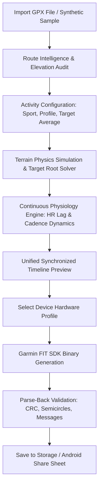

# Strava Kalcer — Native Android Fitness Simulation & FIT Engine

[-FF5722.svg?logo=android&logoColor=white)](https://github.com/ardianrifendy/strava-kalcer/releases/latest)
[](https://kotlinlang.org/)
[-3DDC84.svg?logo=android&logoColor=white)](https://developer.android.com/)
[](https://developer.android.com/jetpack/compose)
[](https://developer.garmin.com/fit/overview/)
[](#panduan-build--menjalankan--how-to-build--test)
[](LICENSE)

**Strava Kalcer** is a high-fidelity, native Android activity reconstruction and simulation engine built with **Kotlin**, **Jetpack Compose**, and the official **Garmin FIT SDK (`com.garmin:fit`)**.

Unlike simplistic GPX-to-FIT converters that merely stamp static speeds or arbitrary time intervals onto coordinates, **Strava Kalcer** runs a physics-driven numerical solver and continuous cardiovascular/neuromuscular models to transform raw GPX routes into realistic, internally consistent, and physiologically coherent sports activities.

---

## 📱 Unduh APK Siap Pakai / Download APK

Berkas APK Android yang sudah siap di-install (kompatibel untuk Android 8.0 Oreo ke atas / API 26+) tersedia di GitHub Releases:

| Berkas Instalasi | Versi | Ukuran | Tautan Unduh Langsung |
| :--- | :--- | :--- | :--- |
| **Strava Kalcer Android APK** | `v1.0.0` | ~16.4 MB | 👉 [**Download StravaKalcer-v1.0.0-debug.apk**](https://github.com/ardianrifendy/strava-kalcer/releases/download/v1.0.0/StravaKalcer-v1.0.0-debug.apk) |

> [!TIP]
> **Cara Instalasi di HP Android**:
> 1. Unduh file APK di atas melalui browser HP Anda (atau transfer dari PC).
> 2. Buka file `.apk` yang telah diunduh, lalu pilih **Install**.
> 3. Jika muncul peringatan keamanan, izinkan *Install unknown apps* / *Izinkan dari sumber ini*.

---

## 📑 Daftar Isi / Table of Contents
1. [Unduh APK Siap Pakai / Download APK](#-unduh-apk-siap-pakai--download-apk)
2. [Mengapa Strava Kalcer? / Why Strava Kalcer?](#mengapa-strava-kalcer--why-strava-kalcer)
3. [Arsitektur & Modularitas / Architecture](#arsitektur--modularitas--architecture)
4. [Alur Simulasi / Simulation Pipeline](#alur-simulasi--simulation-pipeline)
5. [Fitur Unggulan / Key Features](#fitur-unggulan--key-features)
6. [Daftar Perangkat yang Didukung / Supported Devices](#daftar-perangkat-yang-didukung--supported-devices)
7. [Berkas Sampel & Deliverables / Sample Deliverables](#berkas-sampel--sample-deliverables)
8. [Panduan Build & Menjalankan / How to Build & Test](#panduan-build--menjalankan--how-to-build--test)
9. [Dokumentasi Algoritma / Mathematical Formulations](#dokumentasi-algoritma--mathematical-formulations)

---

## Mengapa Strava Kalcer? / Why Strava Kalcer?

Perbandingan antara konverter GPX tradisional dengan simulasi cerdas Strava Kalcer:

| Fitur / Parameter | Konverter GPX Standar | **Strava Kalcer Engine** |
| :--- | :--- | :--- |
| **Profil Kecepatan** | Kecepatan konstan / flatline buatan | **Dinamis & berbasis kontur**: menanjak melambat, turunan meluncur cepat |
| **Akselerasi & Deselerasi** | Lompatan instan tidak realistis | **Terikat inersia fisik**: percepatan dan pengereman bertahap (kinematic bounds) |
| **Target Rata-rata** | Memotong kecepatan titik demi titik | **Root Solver Global**: rata-rata target tercapai dengan tetap mempertahankan kurva elevasi asli |
| **Detak Jantung (Heart Rate)** | Angka acak / konstan tanpa jeda | **Model Asimetris 1st-Order**: ada cardiac lag saat sprint (~12s) dan peluruhan lambat (~26s) |
| **Kadensi (Cadence)** | Flat konstan (misal selalu 90 rpm) | **Adaptif**: torsi tinggi saat tanjakan, freewheel coasting ($0\text{ rpm}$) saat turunan terjal |
| **Validasi Berkas FIT** | Langsung simpan tanpa verifikasi | **Parse-Back Validator**: berkas dibaca ulang oleh parser Garmin resmi untuk verifikasi CRC & konsistensi data |
| **Kepatuhan Protokol** | Sering gagal di platform analitik | **100% Garmin FIT Protocol**: FileId, Activity, Session, Lap, & Record messages |

---

## Arsitektur & Modularitas / Architecture

Aplikasi dirancang dengan arsitektur multi-module yang bersih:

```
Strava Kalcer
├── core-simulation/          # Pure Kotlin JVM library (independen dari Android UI/Android framework)
│   ├── gpx/                  # GPX 1.1 parser, elevation quality auditor, GeoMath (Haversine & Bearing)
│   ├── intelligence/         # Route intelligence (kategorisasi tanjakan/turunan, grade smoothing)
│   ├── simulation/           # Cycling & running terrain physics, dynamic target-average root solver
│   ├── physiology/           # Continuous differential Heart Rate & Cadence models
│   ├── device/               # Device profile registry (Garmin, Wahoo, Coros, Suunto, Polar, dll.)
│   ├── fit/                  # Garmin FIT binary encoder & parse-back validator
│   ├── debug/                # CSV diagnostic export & explainability reasons
│   └── sample/               # Synthetic route generator untuk demonstrasi instan
│
└── app/                      # Android Jetpack Compose application module (Material 3 Dark Theme)
    ├── theme/                # Athletic color palette, typography & tokens
    ├── ui/components/        # Multi-chart canvas tersinkronisasi, route polyline map canvas
    ├── ui/screens/           # Home, Route Review, Settings, Preview, Device Select, Export, Debug
    └── viewmodel/            # Reactive state management berbasis Kotlin StateFlow & Coroutines
```

---

## Alur Simulasi / Simulation Pipeline



1. **Import GPX**: Membaca file GPX atau menggunakan generator rute sintetis bawaan.
2. **Audit Kualitas Elevasi**: Mengklasifikasikan data elevasi sebagai *Original*, *Reconstructed*, atau *Unavailable*.
3. **Pengaturan Aktivitas**: Pilihan mode (Cycling / Running), gaya usaha (*Casual*, *Endurance*, *Tempo*, *Race*, *Climber*), dan target rata-rata kecepatan/pace.
4. **Fisika Medan**: Menghitung kecepatan per titik dengan hukum gravitasi, hambatan angin, dan batas akselerasi/deselerasi.
5. **Model Fisiologi**: Mensimulasikan respon kardiovaskular berkelanjutan dan kadensi pedal/langkah.
6. **Pratinjau Sinkron**: Satu kursor interaktif mengontrol peta, profil elevasi, kecepatan, HR, dan kadensi secara *real-time*.
7. **Pilihan Perangkat**: Memilih metadata *head unit* (Garmin Edge, Wahoo, COROS, dll.).
8. **Enkoding FIT**: Menghasilkan berkas biner FIT resmi Garmin.
9. **Validasi Mandiri**: Membaca kembali (*parse-back*) berkas sebelum diunduh untuk menjamin integritas.

---

## Fitur Unggulan / Key Features

- **Fisika Berbasis Kontur Nyata**:
  Tanjakan curam mengurangi kecepatan secara realistis, sedangkan turunan meningkatkan kecepatan dengan batasan aerodinamika terminal dan perlambatan sebelum tikungan tajam.
- **Root Solver Target Rata-rata**:
  Target kecepatan rata-rata (misal 30 km/jam pada sepeda) atau target pace (misal 5:00 min/km pada lari) dicapai melalui pencarian biner/metode secant pada ruang tenaga, bukan memotong data secara konstan.
- **Fisiologi Berkelanjutan (Lag & Recovery)**:
  Detak jantung naik dengan jeda inersia kardiovaskular ($\tau_{\text{rise}} \approx 12\text{ detik}$) dan turun perlahan saat usaha mereda ($\tau_{\text{decay}} \approx 26\text{ detik}$).
- **Kadensi Fleksibel & Dapat Dikustomisasi (Customizable Cadence)**:
  Target kadensi bebas diatur sesuai preferensi (slider & preset chip RPM untuk sepeda: 60-115 RPM, SPM untuk lari: 145-195 SPM), lengkap dengan tombol kontrol *freewheeling coasting* saat turunan terjal (0 RPM vs 20 RPM) serta adaptasi penurunan torsi saat tanjakan.
- **Satu Kursor Waktu Terpadu**:
  Semua grafik (Elevation, Speed, HR, Cadence) dan titik pada peta diikat oleh satu timeline global. Menggeser kursor pada satu grafik menggerakkan seluruh visualisasi secara harmonis.
- **Full Auto Strava Cloud Upload (Langsung ke Feed Strava)**:
  Mendukung integrasi resmi Strava API (OAuth 2.0 & Personal Access Token). Cukup aktifkan *Full Auto*, dan setiap kali berkas FIT selesai dibuat, aplikasi otomatis mengunggah aktivitas ke server Strava di latar belakang tanpa perlu membuka browser.
- **Garmin FIT SDK Resmi & Self-Validation**:
  Menggunakan `com.garmin:fit` versi 21.141.0. Menghasilkan koordinat dalam bentuk *semicircles*, timestamp UTC berurutan, akumulasi jarak akurat, serta validasi CRC internal sebelum ekspor.
- **Antarmuka Elegan & Bersih**:
  Desain bertema gelap *Athletic Dark Palette* menggunakan Material 3. Menggunakan vector icons resmi Android tanpa emoji.

---

## Daftar Perangkat yang Didukung / Supported Devices

Strava Kalcer menyertakan profil metadata perangkat olahraga populer:

| Manufaktur | Model yang Didukung | Serial / Identifier |
| :--- | :--- | :--- |
| **Garmin** | Edge 1040, Edge 1030 Plus, Edge 830, Edge 530, Forerunner 965, Forerunner 955 | ID Produsen Resmi Garmin |
| **Wahoo** | ELEMNT ROAM v2, ELEMNT BOLT v2 | Metadata Wahoo Fitness |
| **Hammerhead** | Karoo 2 | Android Cycling Computer Profile |
| **COROS** | PACE 3, PACE 2, VERTIX 2 | Profile Wearable Multisport |
| **Suunto** | Suunto 9 Peak, Suunto Vertical | Profile Barometric GPS |
| **Polar** | Grit X Pro, Vantage V2 | Precision Bio-sensor Profile |

---

## Berkas Sampel & Deliverables / Sample Deliverables

- 📱 [**StravaKalcer-v1.0.0-debug.apk**](https://github.com/ardianrifendy/strava-kalcer/releases/download/v1.0.0/StravaKalcer-v1.0.0-debug.apk): Berkas APK Android siap pakai (16.4 MB) untuk pengujian langsung di perangkat fisik atau emulator.
- 🗺️ [`samples/sample_loop.gpx`](samples/sample_loop.gpx): Rute loop rolling terrain 4.5 km lengkap dengan variasi tanjakan dan turunan.
- 🚴 [`samples/sample_validated.fit`](samples/sample_validated.fit): Berkas biner Garmin FIT hasil simulasi yang telah lulus validasi CRC dan siap diunggah ke Garmin Connect, Strava, atau TrainingPeaks.
- 📊 [`samples/sample_diagnostic.csv`](samples/sample_diagnostic.csv): Berkas diagnostik per-detik berisi data: waktu, koordinat, elevasi, grade %, kecepatan, detak jantung, kadensi, dan alasan model fisika (*explainability log*).

---

## Panduan Build & Menjalankan / How to Build & Test

### Kebutuhan Sistem
- **Java Development Kit (JDK)**: Versi 17 (Microsoft OpenJDK 17 atau Eclipse Temurin 17).
- **Android SDK**: Platform 34 (Android 14) & Build-Tools 34.0.0.
- **Gradle**: 8.5 (sudah disediakan melalui `gradlew.bat`).

### Perintah Pembangunan

1. **Jalankan Seluruh Test Suite Otomatis**:
   ```powershell
   .\gradlew.bat test
   ```
   *Memverifikasi 18 pengujian unit & integrasi untuk fisika, pemecah akar, model jantung, dan serialisasi FIT biner.*

2. **Kompilasi & Hasilkan File APK**:
   ```powershell
   .\gradlew.bat assembleDebug
   ```
   *Output APK akan berada di:*
   `app/build/outputs/apk/debug/app-debug.apk`

3. **Install Langsung ke HP / Emulator Android**:
   ```powershell
   .\gradlew.bat installDebug
   ```

---

## Dokumentasi Algoritma / Mathematical Formulations

### 1. Jarak Haversine & Geodesik
$$a = \sin^2\left(\frac{\Delta \phi}{2}\right) + \cos(\phi_1)\cos(\phi_2)\sin^2\left(\frac{\Delta \lambda}{2}\right)$$
$$s = 2 R \operatorname{atan2}(\sqrt{a}, \sqrt{1 - a})$$

### 2. Gradient Smoothing & Pemodelan Tanjakan
$$G_{\text{raw}} = \frac{\Delta h}{s} \times 100\%,\quad G_{\text{smooth}, i} = \frac{1}{2k + 1} \sum_{j = i - k}^{i + k} G_{\text{raw}, j}$$

### 3. Batas Inersia Fisik & Model Kardiovaskular
- **Akselerasi & Deselerasi Kinematik**: $v_i \le \sqrt{v_{i-1}^2 + 2 a_{\max} s_i}$
- **Respon Heart Rate Asimetris (1st-Order Lag)**: $\tau_{\text{rise}} \approx 12\text{s}$, $\tau_{\text{decay}} \approx 26\text{s}$
- **Enkoding Koordinat Garmin FIT**: $\text{semicircles} = \text{degrees} \times \frac{2^{31}}{180}$

---

## Lisensi / License

Project ini dilisensikan di bawah [MIT License](LICENSE).
Dikembangkan untuk kebutuhan analisis rute olahraga dan rekonstruksi aktivitas digital.
